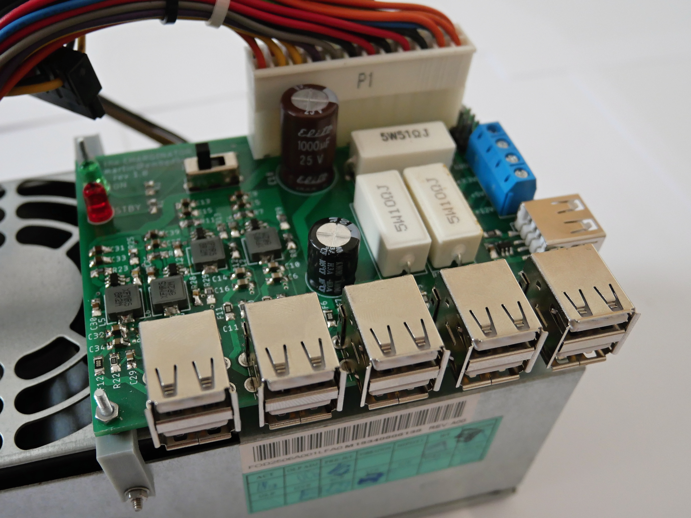
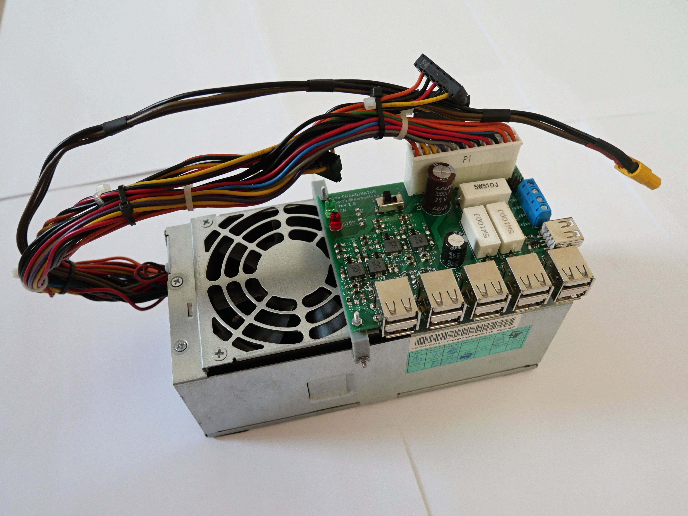

# The CHARGINATOR
*Upcycle your old ATX power supply into this 11-port QC-compatible charging monstrosity!*

Features:
* connects to an old PC power supply via a 24-pin MOLEX Mini-fit Jr. connector.
* provides power-on switch and LED, stand-by LED and three load resistors.
* 4 USB ports, compatible with QC3.0 (up to 24 W per port, 12 V 2 A), FCP (Huawei), DCP (Apple) and BCP (Battery Charging Protocol).
* 6 USB ports, compatible with DCP and BCP (5 V 2 A per port).
* 1 USB stand-by port, copatible with DCP and BCP (5 V 2 A per port).
* Each output individually fused with resetable fuse.
* Also, screw terminals with 3.3, 5 and 12 V are available.

Links:
* [Hackaday article]()
* [Article on my blog, explaining how the QC part works](http://embedblog.eu/?p=504)
* [FP6601 datasheet](https://datasheet.lcsc.com/szlcsc/Fitipower-Integrated-Tech-FP6601QS6_C86198.pdf)

